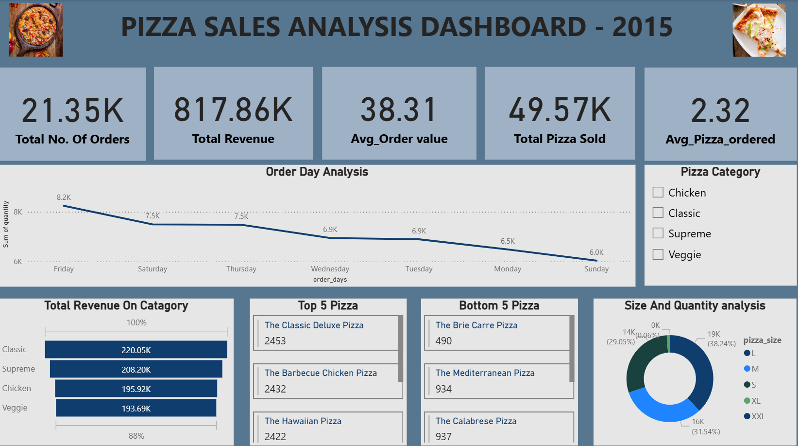

# 🍕 Pizza Sales Analysis Dashboard — Power BI (2015)


> An interactive **Power BI Sales Dashboard** analyzing pizza sales data for the year **2015** — uncovering revenue trends, best/worst performers, order patterns, and size preferences.

---

## 📸 Dashboard Preview



---

## 📽️ Demo Video

[▶ Watch Demo](https://github.com/user-attachments/assets/4531a173-4d9e-4233-a82d-d8736cf4c1ef)

---

## 📊 Key Metrics

| Metric | Value |
|--------|-------|
| 🧾 Total Orders | **21.35K** |
| 💰 Total Revenue | **$817.86K** |
| 📦 Total Pizzas Sold | **49.57K** |
| 💵 Avg. Order Value | **$38.31** |
| 🍕 Avg. Pizzas per Order | **2.32** |

---

## 🔍 Dashboard Features

### 📅 Order Day Analysis
- Visualizes sales volume across all 7 days of the week
- **Friday** is the busiest day with **8.2K orders**
- **Sunday** records the lowest volume at **6.0K orders**

### 🏆 Top 5 Pizzas (by Quantity Sold)
| Rank | Pizza Name                 | Qty Sold |
| ---- | -------------------------- | -------- |
| 1    | The Classic Deluxe Pizza   | 2,453    |
| 2    | The Barbecue Chicken Pizza | 2,432    |
| 3    | The Hawaiian Pizza         | 2,422    |
| 4    | The Pepperoni Pizza        | 2,418    |
| 5    | The Thai Chicken Pizza     | 2,371    |


### 📉 Bottom 5 Pizzas (by Quantity Sold)
| Rank | Pizza Name                | Qty Sold |
| ---- | ------------------------- | -------- |
| 1    | The Brie Carre Pizza      | 490      |
| 2    | The Mediterranean Pizza   | 934      |
| 3    | The Spinach Supreme Pizza | 950      |
| 4    | The Calabrese Pizza       | 937      |
| 5    | The Soppressata Pizza     | 961      |


### 💼 Revenue by Category
| Category | Revenue |
|----------|---------|
| Classic | $220.05K |
| Supreme | $208.20K |
| Chicken | $195.92K |
| Veggie | $193.69K |

### 📐 Size & Quantity Distribution
- **Large (L)** — 38.24% (most popular)
- **Medium (M)** — 31.54%
- **Small (S)** — 29.05%
- **XL / XXL** — < 1%

---

## 🛠️ Tools & Technologies

- **Power BI Desktop** — Dashboard creation & visualization
- **Microsoft Excel Open XML Spreadsheet** — Raw data source
- **DAX (Data Analysis Expressions)** — Custom KPI measures
- **Power Query** — Data cleaning & transformation

---

## 📁 Project Structure

```
pizza-sales-dashboard/
│
├── 📂 assets/
│   └── dashboard_preview.png       # Dashboard screenshot
│
├── 📂 data/
│   └── pizza_sales.xlsx             # Raw sales dataset
│
├── 📂 pbix/
│   └── Pizza_Sales_Dashboard.pbix  # Power BI project file
│
└── README.md
```

---

## 🚀 Getting Started

### Prerequisites
- [Power BI Desktop](https://powerbi.microsoft.com/en-us/desktop/) (free)

### Steps

1. **Clone this repository**
   ```bash
   git clone https://github.com/Jeeleej/pizza-sales-dashboard.git
   cd pizza-sales-dashboard
   ```

2. **Open the Power BI file**
   - Launch Power BI Desktop
   - Open `pbix/Pizza_Sales_Dashboard.pbix`

3. **Connect to data** *(if prompted)*
   - Point to `data/pizza_sales.xlsx`
   - Click **Refresh**

4. **Explore the dashboard!** 🎉

---

## 📌 Insights & Findings

- 🔥 **Fridays drive the most sales** — ideal day for promotions
- 🍕 **Classic category leads in revenue** despite close competition across all 4 categories
- 📦 **Large size is the most preferred** pizza size (~38%)
- ⚠️ **Brie Carre Pizza** is significantly underperforming — potential candidate for discontinuation or repricing
- 📈 **Weekday sales are fairly stable** (6.9K–7.5K), suggesting a consistent customer base

---

## 🤝 Contributing

Contributions are welcome! Feel free to:
- Open an **Issue** for suggestions or bugs
- Submit a **Pull Request** with improvements

---

## 📄 License

This project is licensed under the [MIT License](LICENSE).

---

## 👤 Author

**Jeel Vaghasiya**
- GitHub: [@Jeeleej](https://github.com/Jeeleej)

---

⭐ *If you found this project helpful, please give it a star!*
